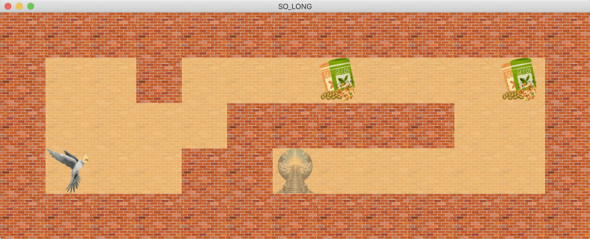

# So Long


##  Description
**So Long** is a graphical project from the **42 School curriculum** designed to deepen the understanding of **game development fundamentals**, including rendering, event handling, and basic game mechanics. The objective is to create a small 2D game where the player must navigate through a maze, collecting items and avoiding obstacles to reach an exit.

This project helped enhance my understanding of **2D graphics programming**, **event-driven systems**, and **memory management** in C.




---

##  Features

- **Maze Rendering:**
  - Rendered the maze using a graphical library.
  - Dynamically loaded maps based on customizable `.ber` files.

- **Player Movement:**
  - Implemented movement mechanics for navigating the maze.
  - Added collision detection to prevent invalid moves.

- **Item Collection:**
  - Players collect items to unlock the exit.
  - Displayed the remaining collectible count dynamically.

- **Game Mechanics:**
  - Added a win condition when all items are collected, and the player reaches the exit.


---

## Technologies Used

- **Language:** C
- **Graphics Library:** MLX42
- **Build Tools:** Makefile

---

## How It Works

1. **Game Map:**
   - The game reads a `.ber` file containing the maze layout.
   - Example:
     ```
     11111
     1C0P1
     10001
     1E001
     11111
     ```
     - `1`: Wall
     - `0`: Walkable area
     - `C`: Collectible
     - `P`: Player
     - `E`: Exit

2. **Gameplay:**
   - Navigate the maze using the keyboard.
   - Collect all items (`C`) to unlock the exit (`E`).

3. **End Conditions:**
   - **Win:** Player collects all items and reaches the exit.
   - **Optional Lose (if applicable):** Player collides with an enemy.

---

## Key Learnings

- **2D Graphics Programming:** Rendering and managing graphics using MLX42.
- **Event Handling:** Capturing and processing user input.
- **File Parsing:** Reading and validating map files.
- **Memory Management:** Efficient allocation and cleanup to prevent memory leaks.

---


##  Installation

1. Clone the repository:
   ```bash
   git clone git@github.com:Mimadfaoussi/so_long.git
   cd solong
   ```

2. Build the project using the Makefile:
   ```bash
   make
   ```

3. Run the game:
   ```bash
   ./so_long maps/map.ber
   ```

## enjoy :)

